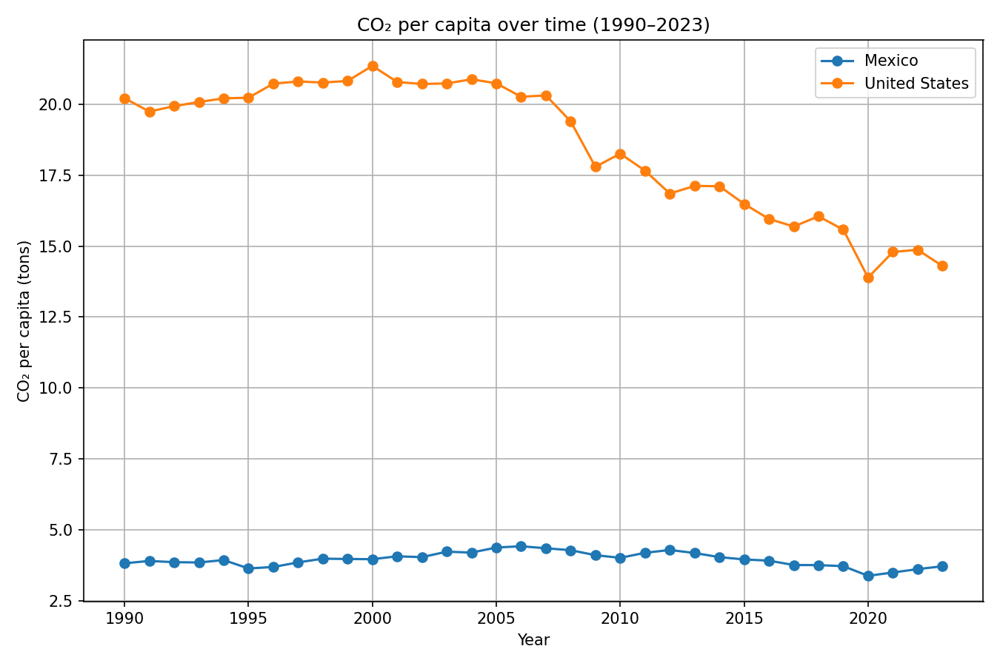
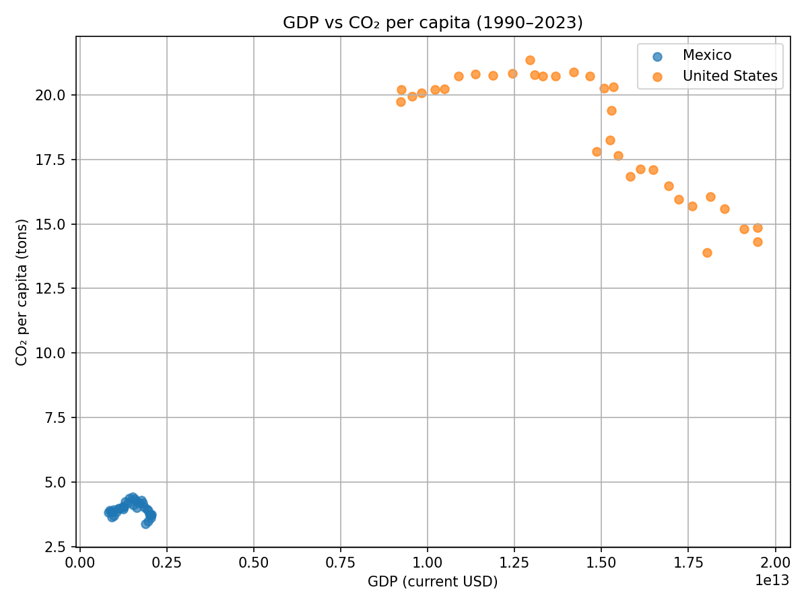
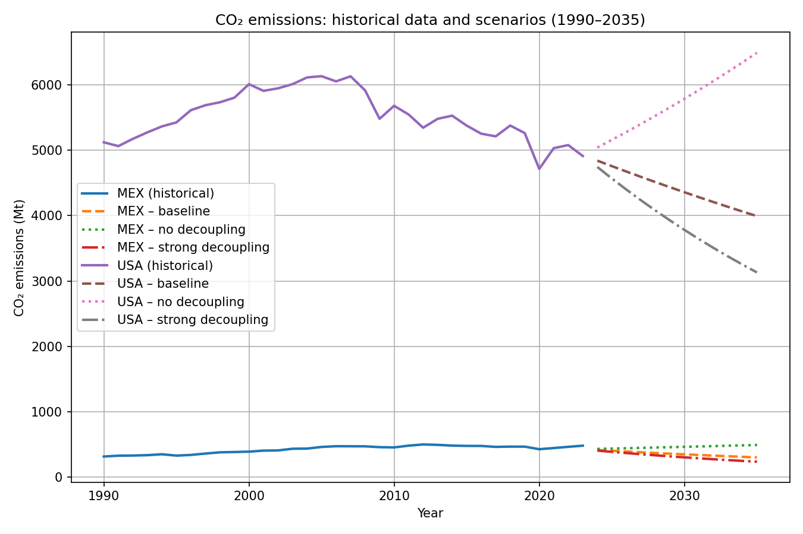

# ds-practical-exam

## Decarbonization dynamics, regime transitions, and strategic prioritization

This repository contains the complete analytical pipeline for a data science exam project focused on the relationship between economic growth and CO₂ emissions, the detection of emissions regime transitions, and the strategic prioritization of mitigation investments under constraints.

The project combines econometric modeling, scenario analysis, machine learning classification, and policy-oriented decision frameworks.

---

## Project structure

```text
.
├── data/
│   ├── raw/                    # Raw input data (World Bank, OWID)
│   ├── interim/                # Intermediate datasets
│   └── processed/              # Final datasets used in analysis
├── scripts/                    # Reproducible analysis pipelines
│   ├── q4a_fetch_panel_all.py
│   ├── q4a_build_multicountry_panel.py
│   ├── q4a_features.py
│   ├── q4a_train.py
│   └── q5_prioritization.py
├── src/
│   └── ds_exam/                # Core utilities (data handling, modeling)
├── reports/
│   ├── Q2_predictive_modeling.md
│   ├── Q3_fermi_sensitivity_ev.md
│   ├── Q4_classification_policy.md
│   ├── Q5_strategic_analysis.md
│   └── Conclusion.md
├── outputs/
│   ├── figures/
│   └── tables/
├── docs/
│   └── Decision_Sciences_Practical_Exam.pdf
├── README.md
└── .gitignore
```

---

## Analytical overview

### Q2 — Econometric foundations
- Panel OLS models for Mexico and the United States (1990–2023)
- Total CO₂ emissions and per-capita emissions
- Fixed effects and EKC robustness checks
- Key result: time dynamics dominate static income effects

See: `reports/Q2_predictive_modeling.md`

---

### Q3 — Scenario and sensitivity analysis
- Fermi-style scenario exploration
- Small changes in decoupling rates generate large long-run emissions gaps
- Emphasis on leverage and path dependence

See: `reports/Q3_fermi_sensitivity_ev.md`

---

### Q4 — Classification and explainability (Q4A)
- Multicountry supervised classification (~200 countries)
- Target: entry into low-emissions-growth regimes
- Dynamic features (first differences)
- Rolling temporal validation
- SHAP-based explainability

See: `reports/Q4_classification_policy.md`

---

### Q5 — Strategic investment prioritization
- Translation of Q2–Q4 into a decision-oriented framework
- Allocation under constraints
- Readiness–impact tradeoff
- Investment typology: high-probability, marginal, low-probability transitions

See: `reports/Q5_strategic_analysis.md`

---

## Reproducing the analysis

1. Environment setup

```bash
python -m venv .venv
source .venv/bin/activate
pip install -r requirements.txt
```

2. Build the multicountry panel (Q4A)

Fetch and harmonize World Bank and Our World in Data (OWID) inputs:

```bash
PYTHONPATH=src python scripts/q4a_fetch_panel_all.py
```

Build the country–year panel:

```bash
PYTHONPATH=src python scripts/q4a_build_multicountry_panel.py
```

3. Feature engineering

Construct interpretable level and dynamic features:

```bash
PYTHONPATH=src python scripts/q4a_features.py
```

Output: `data/processed/q4a_features.parquet`

4. Train classification models

Run rolling temporal validation and export predictions:

```bash
PYTHONPATH=src python scripts/q4a_train.py
```

Typical outputs:
- Model metrics
- Rolling-split performance
- Country–year predictions

5. Strategic prioritization (Q5)

Translate classification results into investment categories:

```bash
PYTHONPATH=src python scripts/q5_prioritization.py
```

---

## Key methodological principles

- Temporal integrity: no information leakage across time
- Interpretability: compact, theory-consistent feature sets
- Robustness: consistency across econometrics, scenarios, and ML
- Policy relevance: emphasis on dynamics and early-warning signals

---

## Exam statement

See `docs/Decision_Sciences_Practical_Exam.pdf` for the exam specification and instructions.

---

## Conclusion

This project shows that decarbonization outcomes are not determined by income levels alone. Instead, how emissions evolve relative to growth—and how quickly those dynamics change—drives both long-run outcomes and strategic policy relevance.

Dynamic signals dominate static indicators, and early detection of regime transitions enables more effective and efficient allocation of limited mitigation resources.

---

## Figures

Below are example figures generated during the analysis and saved under `data/processed/`.

Co₂ per capita timeseries:



GDP vs CO₂ per capita (scatter):



Q3 — Scenario projections (example):



Q4 — SHAP explainability (example):


## Author

Prepared as part of a Data Science practical exam. All analysis and interpretations are for academic evaluation purposes.

