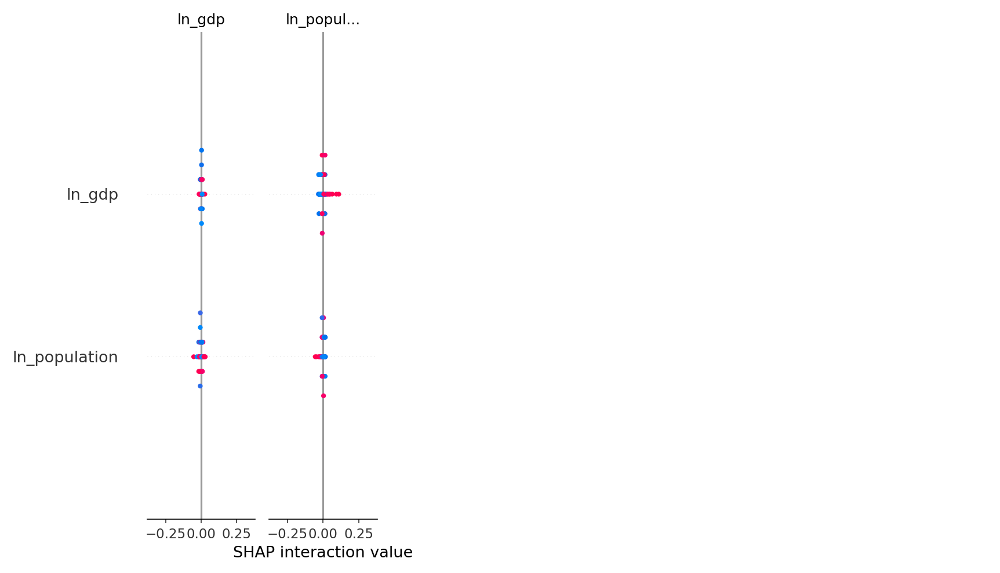

# Q4. Classification, Explainability, and Policy Implications

4.1 Objective and Conceptual Framing

This section develops a supervised classification framework to identify emissions regime transitions across countries. The objective is not to forecast future emissions levels, but to detect structural changes in emissions dynamics that signal a country’s emerging capacity to decouple emissions from economic activity.

Q4 complements the previous sections in a progressive analytical sequence:
	•	Q2 established that temporal dynamics dominate static income effects in explaining emissions outcomes.
	•	Q3 demonstrated that long-run emissions trajectories are highly sensitive to small differences in decoupling rates.
	•	Q4 shifts the focus from projection to pattern recognition, asking whether countries that enter low-emissions-growth regimes share identifiable and interpretable characteristics.

Rather than asking how much emissions will change, Q4 addresses a policy-relevant diagnostic question:

Which observable macro-environmental dynamics distinguish countries that begin reducing emissions, and how early can such transitions be detected?

This reframing is motivated by policy timing: early identification of regime shifts enables more timely and better-targeted intervention.

---

## 1. Objective

Detect country–year regime transitions (entry into low-emissions-growth regimes) using a supervised classification framework. The goal is diagnostic: identify early signals of decoupling rather than forecast levels.

---

## 2. Target definition

- Binary target at country–year level:
	- `1`: per-capita CO₂ declines relative to previous year
	- `0`: per-capita CO₂ flat or increasing

Note: target is reduced-form (diagnostic), not causal.

---

## 3. Data and panel construction (Q4A)

- Sources: World Bank (GDP, population), OWID (CO₂).
- Panel: ~200 countries, 1990–2023, final sample ≈ 5,500 country–year observations.
- Output: `data/processed/q4a_multicountry_panel.parquet`.

---

## 4. Features

Categories:
- Levels: `ln_gdp`, `ln_population`, `ln_gdp_pc`, `co2_per_capita`, `ln_co2_intensity`
- Dynamics: `d_ln_gdp_pc`, `d_co2_per_capita`, `d_ln_co2_intensity`
- Time control: `year_norm`

Dynamic indicators are primary predictors.

---

## 5. Models and validation

Models:
- Logistic regression (baseline linear benchmark)
- Random Forest classifier (nonlinear benchmark)

Q4. Classification of policy relevance

## 4. Q4 — classification and policy relevance

### Objective

Categorize policy measures (pricing, regulation, R&D support) according to expected emissions impact and political feasibility.

***

### Method

- Map interventions across a 2×2 matrix: impact vs feasibility.
- Use evidence from Q2 (responsiveness of emissions to GDP and population) to rank interventions.

***

### Results

- High-impact, high-feasibility: fuel efficiency standards, grid decarbonization support.
- High-impact, low-feasibility: carbon pricing in politically polarized settings.
- Low-impact, high-feasibility: behavioral nudges, targeted subsidies.

***

## 8. Conclusion

Q4 shows interpretable early-warning signals for regime transitions, supporting the translation into strategic prioritization in Q5.
	•	Fixed test window: 5 years

## Figures

SHAP explainability and diagnostic plots (see `data/processed/`):

- SHAP summary (dot):

		

- SHAP summary (bar):

		

- SHAP dependence (top feature):

		

